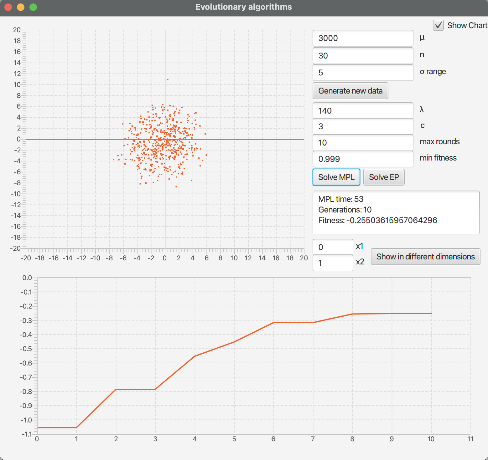
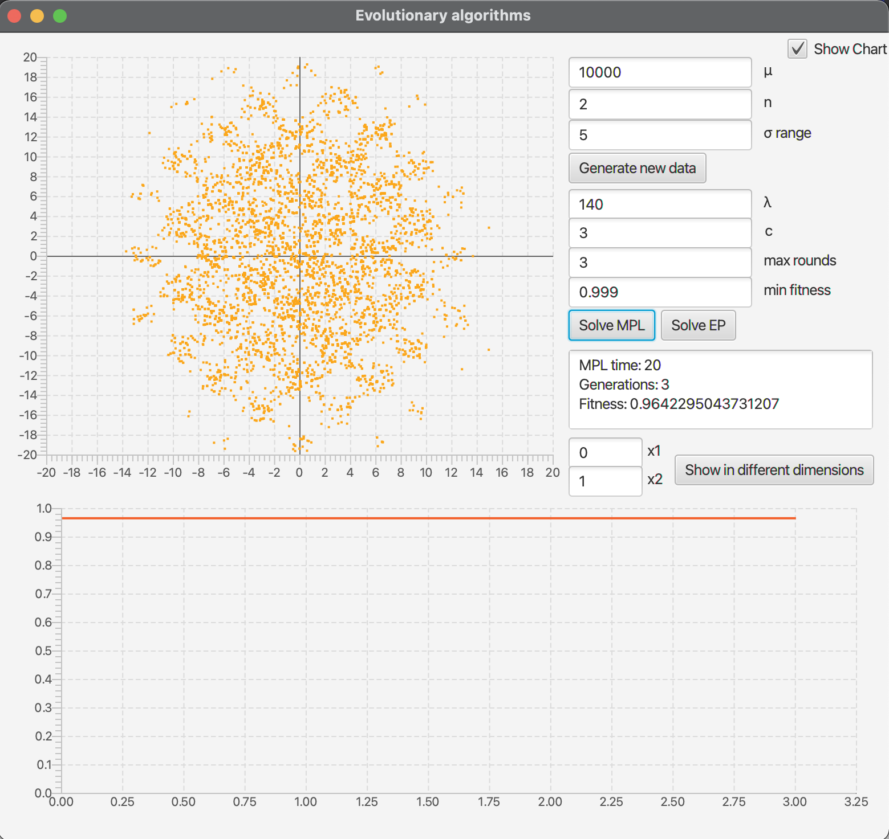
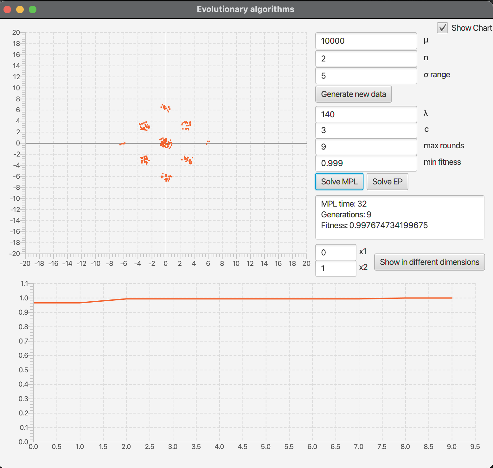

# PSZT_EVO
Solving equation by evolutionary algorithms. (μ+λ) and evolutionary programming

# Build & run
```bash
cd evo/src

# build
javac --module-path=/path/to/javafx/javafx-sdk-15.0.1/lib --add-modules=javafx.controls,javafx.fxml *.java

# run
java --module-path=/path/to/javafx/javafx-sdk-15.0.1/lib --add-modules=javafx.controls,javafx.fxml Main
```

# Application

<html>
<body>
    <div>
        <h4>Generating data</h4>
        <p>
            
        </p>
        <h4>Solving equation with (μ+λ) algorithm (3000 individuals, 30 dimension space, 10 rounds)</h4>
        <p>
            
        </p>
        <h4>Solving equation with EP algorithm (3000 individuals, 30 dimension space, 10 rounds)</h4>
        <p>
            
        </p>
        <h4>Solving equation with (μ+λ) algorithm (10000 individuals, 2 dimension space, 3-6-9 rounds)</h4>
        <p>
            
        </p>
        <p>
            
        </p>
        <p>
            
        </p>
    </div>
</body>
</html>

# Report

Report from project is available [here](docs/Report_PL.pdf) (in Polish).